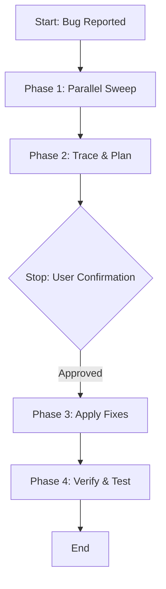

# Bug Investigation & Repair Runbook

This runbook defines a token-efficient, parallelized troubleshooting workflow to sweep, isolate, plan, fix, and verify bugs.

## Trigger Conditions
*   User reports a visual, functional, performance, or compilation issue.
*   Automated test suites or linters output errors.

## Execution Flow

### Phase 1: Parallel Sweep (Max 4 Sub-Agents)
To keep token usage efficient, delegate sweeping tasks to specialized sub-agents in parallel based on the error context:
1.  **Frontend Sweep**: If the bug is visual or client-state related, spawn a sub-agent to search React components (`frontend/src/`) and CSS files.
2.  **API Sweep**: If the bug involves requests, status codes, or middleware, spawn a sub-agent to search Functions (`frontend/functions/api/`).
3.  **Database Sweep**: If the bug relates to missing data, SQL syntax errors, or schema problems, spawn a sub-agent to check query parameters and schemas.
4.  **DevOps & Build Sweep**: If compilation fails or deployment crashes, spawn a sub-agent to examine config files (`tsconfig.json`, `wrangler.toml`).

*Ensure each sweep agent runs read-only commands (e.g. `grep_search`, `view_file`) and reports back with exact line numbers and error traces.*

### Phase 2: Trace & Plan
1.  Synthesize the reports from the sweep agents.
2.  Identify the root cause and trace how the issue cascades across files (e.g., how an API schema mismatch breaks a frontend TypeScript interface).
3.  Formulate a minimal, highly targeted repair plan.
4.  Specify any potential side-effects on existing components.

### Phase 3: Stop & Confirm
> [!IMPORTANT]
> **This is a non-negotiable stop point.** You MUST present the trace findings and repair plan to the user.
> - Explicitly highlight if any database modifications or schema fixes are required.
> - Wait for explicit confirmation before altering any code.

### Phase 4: Apply Fixes
Coordinate with the required sub-agents defined in [AGENTS.md](../../../AGENTS.md):
1.  **Frontend/API/Backend Engineers**: Apply changes to their respective code modules.
2.  **DevOps Engineer**: Address any build configuration discrepancies.
3.  **Audit Engineer**: Verify that the fix does not introduce security vulnerabilities or violate project rules (such as hardcoded secrets).

### Phase 5: Verify & Test
1.  Invoke the **[Testing Skill](../testing/SKILL.md)** to validate the fix.
2.  Run `npm run lint` and `npm run build` on `frontend/` to ensure no linting or type errors remain.
3.  Confirm with the user that the bug is resolved.
