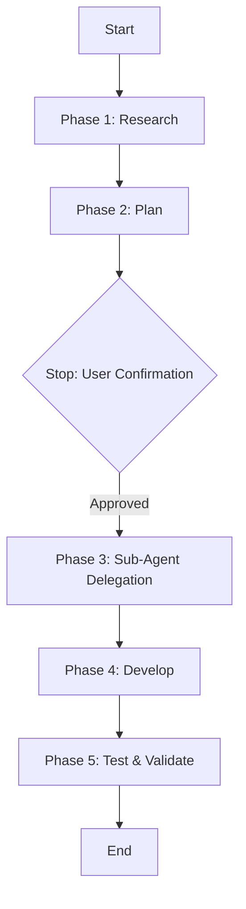

# Feature Development Runbook

This runbook guides agents through the lifecycle of feature development on the **DSA Learning Vault & Product Platform**, ensuring high-quality implementation, security compliance, and proper sub-agent delegation.

## Trigger Conditions
*   User requests a new feature, dashboard view, problem submissions panel, or coding workspace.
*   User asks to create new API endpoints or database tables.

## Execution Flow

### Phase 1: Research
1.  Invoke the **[Research Skill](../research/SKILL.md)** to gather requirements.
2.  Review existing shared UI components in `frontend/src/components/` and current API designs in `frontend/functions/api/` to avoid duplication.
3.  Check existing D1 schemas in `frontend/schema.sql` or `wrangler.toml` to understand the database structure.

### Phase 2: Plan
1.  Formulate a detailed implementation plan.
2.  Identify all files that will be modified, created, or deleted.
3.  Specify the required sub-agents (e.g., API Engineer, Frontend Engineer) and their respective sub-tasks.
4.  Highlight security controls (e.g., how secrets are kept secure and database parameterization is maintained).

### Phase 3: Stop & Confirm
> [!IMPORTANT]
> **This is a non-negotiable stop point.** You MUST display the plan to the user and wait for their explicit approval before proceeding to any code modifications.
> - If database schema updates are planned, highlight them clearly.
> - Do not write to any database or run modifying migrations until approved.

### Phase 4: Sub-Agent Delegation & Development
Coordinate work among the relevant agents defined in [AGENTS.md](../../../AGENTS.md):
1.  **Product Architect**: Translate approved plan to specific code designs.
2.  **Backend Engineer**: Create database tables/schemas and local seed scripts.
3.  **API Engineer**: Build serverless endpoints and middleware in `functions/api/`.
4.  **Frontend Engineer**: Write components, state hooks, and style them using Vanilla CSS.
5.  **Docs Engineer**: Document API usage, roadmaps, and configuration details.

### Phase 5: Test & Validate
1.  Invoke the **[Testing Skill](../testing/SKILL.md)** to ensure comprehensive QA.
2.  Run `npm run lint` and `npm run build` on the `frontend` folder to guarantee compilation and clean linting.
3.  Confirm zero secrets have been committed or exposed.
4.  Run a final audit via the **Audit Engineer** before completion.
